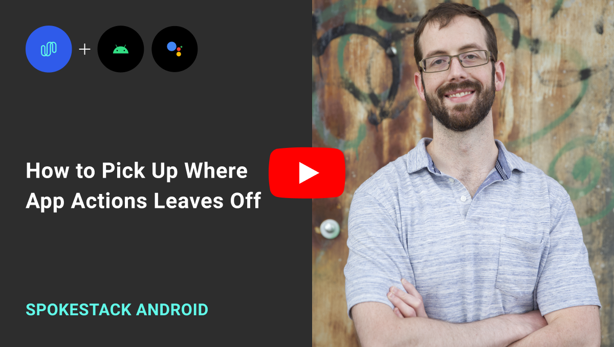

## Google App Actions + Spokestack

<strong>Watch the video tutorial!</strong>

This is sample code that demonstrates how an Android app can use [Spokestack](https://github.com/spokestack/spokestack-android) to offer a voice interface after Google App Actions opens the app on behalf of a user.

It's not a complete app by any means; it provides a single screen that imitates a pizza topping screen. It's meant to mirror [Google's App Actions overview](https://www.youtube.com/watch?v=DozT--NclbM) as closely as possible, except that the voice interaction doesn't stop after Google Assistant opens the app.

To try out the full experience including the App Action itself, you'll have to create a release build and do some setup in the Google Play Console. The process is outlined in [a Google instructional codelab](https://codelabs.developers.google.com/codelabs/appactions/#0). You don't need to do any of that to try the Spokestack integration, though; you just need to run the app on a physical device in order to have speech recognition support.

This isn't the only sample integration we've created — we have [another App Actions sample](https://github.com/spokestack/app-actions-example) that's a slightly more complicated multi-activity (still not production-ready, of course) and a [tutorial series](https://www.spokestack.io/blog/integrating-spokestack-google-app-actions/part-1) to explain what's going on.

### NLU

This repository includes a rudimentary NLU model (in `app/src/main/assets`) for selecting pizza toppings and submitting an order. It was trained using Spokestack's web interface, and the source files are included in the top-level `nlu` directory to give an example of Spokestack's in-house training data format. The training data could just as easily been [exported from another platform](https://www.spokestack.io/docs/integrations/nlu-export) if the app had already existed as, say, a smart speaker skill.
